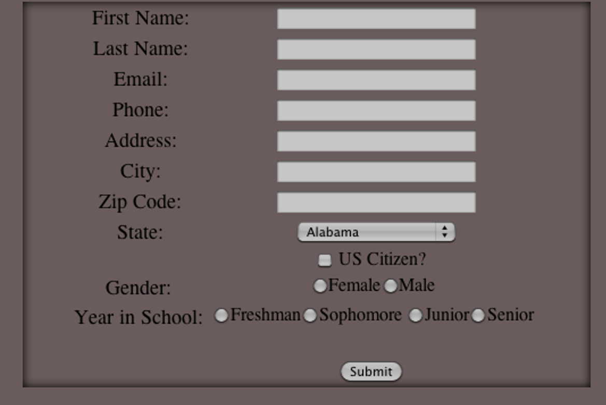

# PHP Form

## Level 1

### Code

- PHP
- HTML
- CSS
- JavaScript
- No JQuery
- No HTML 5

### Requirements

> First: Download MAMP. Follow this link. Click on the download for the latest MAMP. Once you have it downloaded, run MAMP (not MAMP Pro) and click on “Preferences” and then “Web Server”. Change the Document Root to be the folder that holds all the rest of your projects that you have done up to this point. For example, my folder is called Sites. Within Sites I have my clock page, tictactoe, and div positioning pages. So I set my Document Root to my Sites folder. (If another user from your computer has previously installed MAMP on your computer you will need to uninstall MAMP and then reinstall it).

Wonderful. Now make your form.

- Create a simple registration form in which a person may enter their personal information. (hint put this in a .php file not .html)
- Include:
- - Name, Address, and Phone text boxes
- - Gender (male and female)
- - Year in school(freshman, sophomore, junior, senior) radio buttons
- - Home State drop down box
- - US Citizen(one box)
- - Interests (multiple boxes) check boxes
- - Submit button which when pushed will display all the information on the screen

## Level 2 (Optional)

### Requirements

- After the submit button is pressed, hide the form and display the label data names along with their input values using PHP (hint: use the POST method).

## Level 3 (Optional)

### Requirements

- Create a database and a table in that database using mysql
- In your PHP file connect to your database
- After the submit button is pressed insert the first name, last name, email and phone in the database
- After entering it into the database, access the database and using mysql pull it from the database and display it on the screen in the same way you did earlier (first_name: Tom etc)
